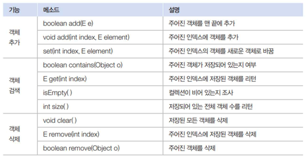
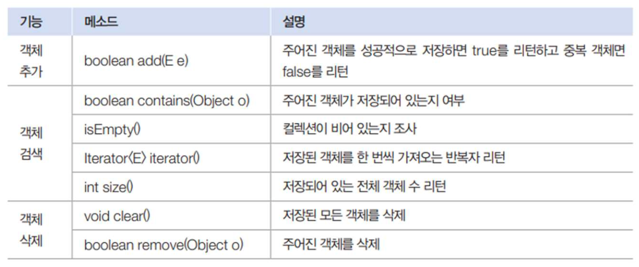
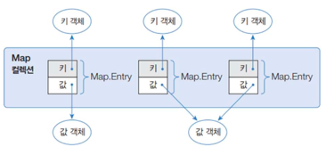
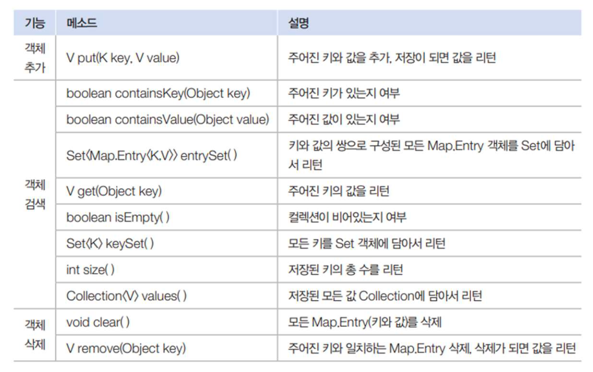

컬렉션 프레임워크

- 널리 알려진 자료구조를 바탕으로 객체들을 효율적으로 추가, 삭제, 검색할 수 있도록 관련 인터페이스와 클래스들을 폼함시켜 놓은 java.util 패키지
- 주요 인터페이스 : List, Set, Map

List

- 색인 베열
- 순서를 유지하고 저장
- 중복 저장 가능
- ArrayList, Vector, LinkedList
- contanins랑 remove는 hashcode랑 equals를 구현해줘야 한다.
- 모든 멤버 젼수를 사용하는 경우 hashCode(), equals() 재정의 하지 않아도 된다.
- 특정 필드만 사용하는 경우는 hashCode(), equlas() 재정의 한다.
```text
ArrayList 컬렉션에 객체를 추가하면 인덱스 0번부터 차례대로 저장된다. 특정 인덱스의 객체를 제거하면 바로 뒤 인덱스부터 마지막
인덱스까지 모두 앞으로 1씩 당겨진다. 마찬가지로 특정 인덱스에 객체를 삽입하면 해당 인덱스부터 마지막 인덱스까지 모두 1씩 밀려난다. 
따라서 빈번한 객체 삭제와 삽입이 일어나는 곳에서는 ArrayList를 사용하는 것은 바람직하지 않다. 대신 이런 경우라면 LinkedList를 사용하는 것이 좋다.
```
```text
Vector는 사용하면 늦기때문에 요새는 쓰지 않고 있음
```
```text
LinkedList
-> 인접 객체를 체인처럼 연결해서 관리 객체 삭제와 삽입이 빈번한 곳에서 ArrayList보다 유리
-> 데이터 많든 적든 속도는 똑같다. 하지만 ArrayList는 데이터가 많아질 수록 느려진다.
-> ListPerformanceTest를 확인해보자!
```



Set

- 순서를 유지하지 않고 저장
- 중복 저장 안됨
- 하나의 null만 저장할 수 있음(수학의 집합 개념)
- 데이터를 빨리 찾을 수 있는 용도 (데이터가 유일하게 존재 할 때 응용)
- HashSet, TreeSet
- contanins랑 remove는 hashcode랑 equals를 구현해줘야 한다.
- 모든 멤버 변수를 사용하는 경우 hashCode(), equals() 재정의 하지 않아도 된다.
- 특정 필드만 사용하는 경우는 hashCode(), equlas() 재정의 한다.
 

```text
HashSet
1. 동등 객체를 중복 저장하지 않음
2. 다른 객체라도 hashCode() 메소드의 리턴값이 같고, equals() 메소드가 true를 리턴하면 동일한 객체라고 판단하고 중복 저장하지 않음
```

Map

- 키와 값으로 구성된 엔트리 저장
- 키는 중복 저장할 수 없지만 값은 중복 저장할 수 있음. 기존에 저장된 키와 동일한 키로 값을 저장하면 새로운 값으로 대치
- 검색이 많은 케이스 Map으로 접근하는게 좋다 해쉬 키가 존재하기에 List보다 빠른 검색이 가능하다.
- HashMap, Hashtable, TreeMap, Properties




```text
HashMap
-> 키로 사용할 객체가 hashCode() 메소드의 리턴값이 같고 equals() 메소드가 true를 리턴할 경우 동일 키로 보고 중복 저장을 허용하지 않음
-> Set으로 관리하기 때문에 Iterator로 순회를 할 수 있다.
-> Iterator보다 Entry로 반복해서 키와 값을 얻을 수 있다.
-> 향상된 for 문을 통해 entrySet()을 이용하는 순회 방식을 많이 사용한다.

HashTable
-> 동기화된 메소드로 구성되어 있어 멀티 스레드가 동시에 HashTable의 메소드들을 실행 불가
-> 멀티 스레드 환경에서도 안전하게 객체를 추가, 삭제할 수 있다.
```

```text
List는 인덱스를 통해 요소에 접근할 수 있는 순서가 있는 컬렉션입니다. 
Set은 중복을 허용하지 않으며, 특히 HashSet은 내부적으로 해시 메커니즘을 사용하여 요소를 저장합니다. 
Map은 키와 값의 쌍으로 구성되며, 키를 사용하여 효율적으로 값에 접근할 수 있는 구조를 가집니다. 
```
```text
배열
1. 색인 배열
    type [] 변수명;
    tyep [] 변수명 = {};
    type [] 변수명 = new type [] {};
    
    List<type> interface
        List interface를 구현한 구현체 ArrayList : 순회는 빠름, 추가, 삭제 불리함
        List interface를 구현한 구현체 LinkedList : 순회는 늦음, 추가, 삭제 좋음
        
    Stack
    큐
    디큐
    
        
    List<type> interface
        List interface를 구현한 구현체 Vector : 스레드에서 사용
    
    
2. 연관 배열
    Map interface
        구현체 HashMap
        
        
Map, List 활용
OCP, DIP
```


```text
프로그램은 단일 스레드로 접근을 해야하고 병렬이 없어야 한다. 동기화는 없어야 하고 동기화 없이 코드를 작성하는게 좋다.!!!
```